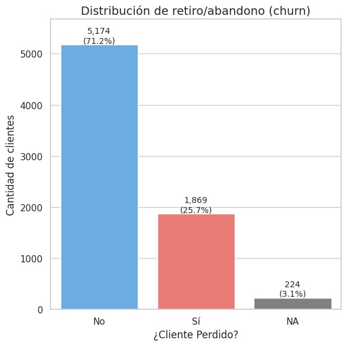
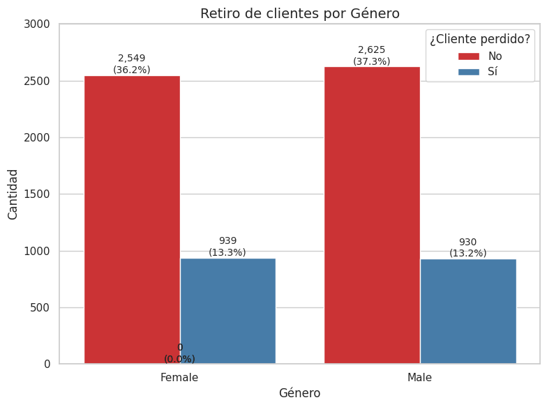
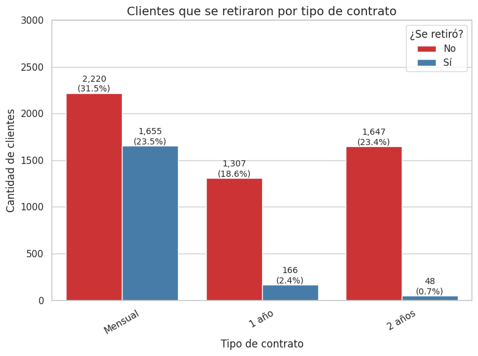
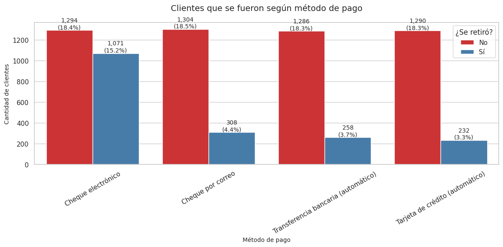
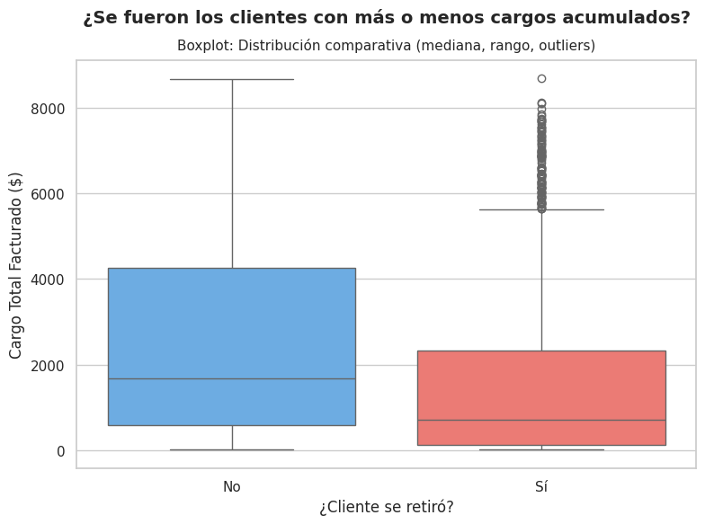
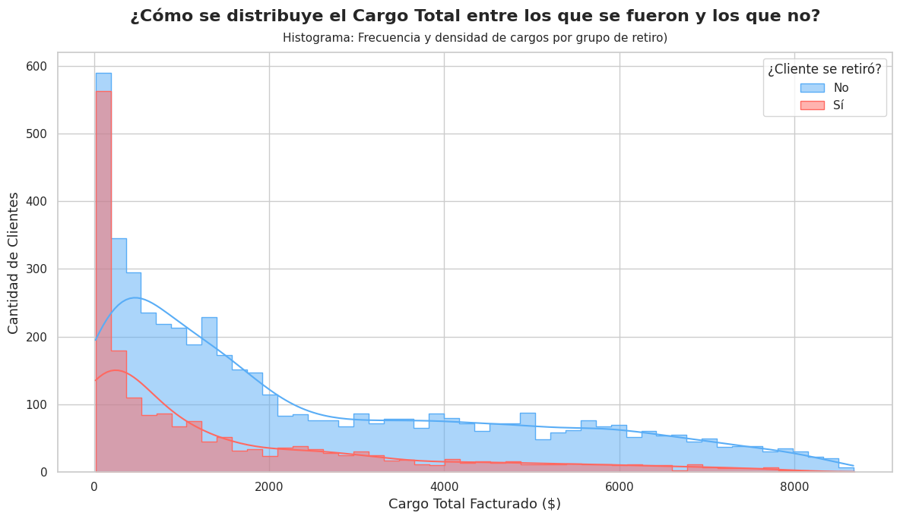

# 🧾 Proceso ETL y Análisis Exploratorio – Churn de Clientes | Telecom X

Este repositorio contiene el desarrollo completo del proceso ETL (Extracción, Transformación y Carga) y el análisis exploratorio de los datos de churn de clientes de la empresa  *Telecom X*.

---

## 🔄 Proceso ETL

### 1. 📥 Extracción

- Lectura directa del archivo `.json` desde un repositorio remoto:
  - URL: `https://raw.githubusercontent.com/LeoSR02/challenge2-data-science-LATAM/refs/heads/main/TelecomX_Data.json`

---

### 2. 🧹 Transformación

- **Normalización** de estructuras anidadas:
  - Columnas: `customer`, `phone`, `account`, `internet`.

- **Limpieza de datos**:
  - Conversión de tipos (`object` → `float`, object → `boolean` ).
  - Eliminación de columnas redundantes.
  - Verificación y tratamiento de valores nulos y duplicados.

- **Renombramiento y creación de nuevas variables**:
  - Ejemplo:  
    - `Cuentas_Diarias = Charges_Monthly / 30`

- **Conversión de variables categóricas a binarias**:
  - Ejemplo: `"Yes"` / `"No"` → `1` / `0`

- **Estandarización de valores**:
  - Limpieza y transformación de datos
  - Ejemplo: replace{
            'No phone service': 'No',
            'No internet service': 'No'}

---

### 3. 💾 Carga

- DataFrame final procesado:
  - `df_final1`

---

## 📈 Análisis Exploratorio

### 🔘 Gráficos

Distribución de clientes según su estado de retiro o abandono (churn):
- El **71.2%** de los clientes **no se han perdido.**
- El **25.7% sí se han perdido**.
- El **3.1%** tiene estado **desconocido (NA).**
---

El gráfico muestra el retiro de clientes por género:
- La proporción de clientes perdidos es **similar entre mujeres (13.3%) y hombres (13.2%).**
- La mayoría de clientes, tanto hombres como mujeres, **no se han perdido.**
---

Clientes que se retiraron por tipo de contrato:
- El gráfico muestra que los clientes con contrato **mensual** tienen una **mayor tasa de retiro**, mientras que los de **1 año y 2 años** presentan menos abandono.
- El gráfico muestra que los clientes con contrato **mensual** tienen una **mayor tasa de retiro**, mientras que los de **1 año y 2 años presentan **menos abandono**.
---

Clientes que se retiraron según método de pago:
- El gráfico muestra que los clientes que pagan con **cheque electrónico** tienen la mayor tasa de retiro, mientras que los que usan **métodos automáticos (tarjeta o transferencia)** presentan **menores tasas de abandono.**
---

El gráfico muestra un boxplot comparando el **cargo total facturado ($)** entre clientes que **se retiraron** y los que **no se retiraron**.

- Los clientes que **no se retiraron** presentan una **mediana (línea central del recuadro)** más alta, lo que indica que su gasto acumulado fue mayor en comparación con los clientes que sí se retiraron.

- Además, el rango intercuartílico (el ancho del box) y la dispersión son mayores para los clientes no retirados, lo que sugiere **más variabilidad en los cargos facturados** dentro de este grupo.

- En cambio, los clientes que **sí se retiraron** muestran una mediana considerablemente más baja y un rango más estrecho, lo que sugiere que la mayoría tuvo cargos bajos antes de abandonar.

- También se observan **muchos outliers** (puntos atípicos) en el grupo de clientes retirados, indicando que aunque pocos, algunos clientes con altos cargos también se retiraron.

- En general, el gráfico sugiere que **los clientes con cargos más bajos fueron más propensos a retirarse**, aunque hay excepciones.
---

El gráfico muestra la distribución del **cargo total** facturado entre clientes que se retiraron y los que no.

- La mayoría de los **clientes que se retiraron** (en rojo) tenían cargos bajos, concentrados cerca de **$0–$1000**.

- Los **clientes que no se retiraron** (en celeste) también se concentran en valores bajos, pero presentan una **distribución más amplia** y con más presencia en valores altos.

- La **densidad** es mayor en cargos bajos para ambos grupos, pero disminuye más rápidamente en los clientes que se fueron.

- Esto sugiere que los clientes con **menores cargos acumulados fueron más propensos a retirarse**, mientras que quienes acumularon mayores cargos **tendieron a permanecer activos**.
---

## ✅ Recomendaciones

- **Ampliar y modernizar métodos de pago digitales**  
  Integrar más opciones de pago como **billeteras digitales**, **códigos QR**, **apps bancarias** y **débito automático**, facilitando una experiencia de pago rápida, segura y sin fricciones.

- **Incentivar el uso de pagos automáticos**  
  Otorgar **bonificaciones o descuentos exclusivos** a clientes que activen el débito automático. Esto fomenta la permanencia y reduce la probabilidad de abandono por olvido o molestias en el pago.

- **Reformular los contratos mensuales para mejorar la retención**  
  Diseñar estrategias de fidelización como:
  - **"3 meses pagados + 1 gratis"**
  - **Descuentos progresivos por permanencia**
  - **Beneficios exclusivos a partir del segundo mes**  
  Esto transforma el contrato mensual en una propuesta más atractiva a mediano plazo.

- **Implementar alertas tempranas para detectar clientes en riesgo**  
  Identificar señales como **bajo uso de servicios**, **inactividad reciente** o **reducción en el consumo**, y activar campañas personalizadas (e.g., recordatorios, beneficios dirigidos, encuestas rápidas) para prevenir el **churn**.

---
